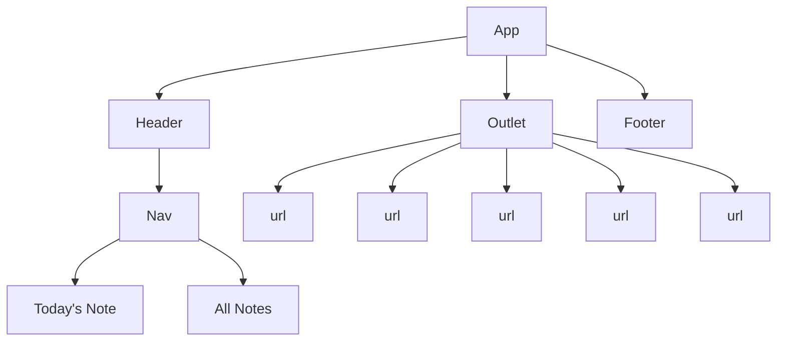

# App Name
<!-- Github Intro -->
Welcome to *App Name* - a full CRUD app for keeping track of your daily to-do lists. Built on a --- backend (with a --- database) and React frontend, *App Name* keeps track of all your day's to-do's, reminders, and events on a single list. With *App Name*, you'll always know exactly what you need to do and remember, everyday.

Deployed Website Link

#### Technologies Used

##### Backend

##### Frontend

#### Component Architecture

#### Frontend Route Table
|    Route     | Element |    Loader   |      Action      |                   Description                  |
|--------------|---------|-------------|------------------|------------------------------------------------|
|      /       | Index   | indexLoader |                  | Loads up all todos                             |
| /todo/:id    | Show    | todoLoader  |                  | Loads up a specific todo                       |
| /create      | Create  |             | todoCreateAction | Handle submission of a create form for todos   |
| /update/:id  | Create  |             | todoUpdateAction | Handle submission of an update form for todos  |
| /delete/:id  | Create  |             | todoDeleteAction | Handle submission of a delete form for todos   |

#### Model

#### User Stories
- As a user, I can see a list of
- As a user, I can see a specific
- As a user, I can create a new
- As a user, I can update a
- As a user, I can delete a

#### Wireframes
##### Mobile

##### Desktop

#### Daily Plan
| Week | Date | Task |
|------|------|------|
|      | 2/21 |  |
|      | 2/22 |  |
|      | 2/23 |  |
|      | 2/24 |  |
|      | 2/25 |  |
|      | 2/26 |  |
|      | 2/27 |  |
|      | 2/28 |  |

#### Stretch Goals
- User Auth

#### Future Goals
- 

##### Links
Deployed Website Link
Trello Board Link