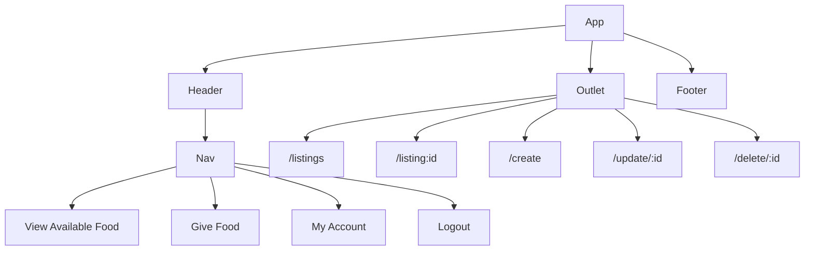

# App Name
<!-- Github Intro -->
Welcome to Leftover - the innovative app designed to connect restaurants with surplus food to those in need. Our platform uses a Django backend and PostgreSQL database, with a Vue frontend, to make it easy for restaurants to list available food, while nearby groups can arrange for pickup. Users can search for local donations, making it simple to find nutritious meals that might otherwise go to waste. By reducing food waste and providing meals to those in need, Leftover is on the frontlines of fighting hunger and supporting communities. Join us today and help make a difference in the lives of people struggling with food insecurity.

<!-- Marketing Intro -->
<!-- Introducing "Leftover", a revolutionary app designed to connect local restaurants with individuals and organizations in need of food. With Leftover, restaurants can easily donate their surplus food from the day to people who are struggling to access nutritious meals.

Using Leftover is simple and convenient. Restaurants can create an account and list the type and quantity of food they have available for donation. This information is then shared with nearby shelters, food banks, and other organizations, who can arrange to pick up the food at a convenient time.

Individuals in need of food can also use the app to find local restaurants offering donations. They can search for nearby restaurants and view the available food items, making it easy to find a meal that fits their dietary needs.

Leftover is a win-win solution for restaurants and the community. Restaurants can reduce food waste, while providing much-needed nourishment to those who need it most. Meanwhile, individuals and organizations can receive high-quality food at no cost, reducing food insecurity and promoting better health outcomes.

Join the Leftover community today and help us make a difference in the fight against hunger. -->

Deployed Website Link

#### Technologies Used

##### Backend
- Python
- Django
- PostgreSQL
- Food API (Edamam or Spoonacular probably)
- Jira

##### Frontend
- Vue
- Javascript
- HTML
- CSS
- SASS
- TailwindCSS

#### Component Architecture

#### Frontend Route Table
|    Route     | Element |    Loader   |      Action      |                   Description                  |
|--------------|---------|-------------|------------------|------------------------------------------------|
|      /       | Index   |indexLoader|          | Loads up all food listings                        |
| /listing/:id | Show    |listingLoader|        | Loads up a specific food listing                  |
| /create      | Create  |       | listingCreateAction | Handle submission of a create form for listings  |
| /update/:id  | Create  |       | listingUpdateAction | Handle submission of an update form for listings |
| /delete/:id  | Create  |       | listingDeleteAction | Handle submission of a delete form for listings  |

#### User Stories
##### Provider Accounts
- AAU, I can login and logout to my account as a providing restaurant.
- AAU, I can see a list of available foods from all restaurants.
- AAU, I can see a list of available foods from my own restaurant.
- AAU, I can see a specific food from a specific restaurant.
- AAU, I can create a new food listing.
- AAU, I can update a food listing.
- AAU, I can delete a food listing.

##### Food Seeker Accounts
- AAU, I can login and logout to my account as an organization/individual seeking food.
- AAU, I can see a list of available foods from all restaurants.
- AAU, I can see a specific food from a specific restaurant.
- AAU, I can contact the providing restaurant.

#### Wireframes
##### Mobile

##### Desktop

#### Daily Plan
| Date | Task |
|------|------|
|   03/4   |  Get Project Approved  |
|   03/5-3/7   |  <ul><li>Make more detailed mockups of each page for web and mobile</li><li>Create Django backend shell and deploy</li></ul>  |
|   3/8   |  One day project w/ Vue  |
|   3/9   |  One day project w/ Tailwind (with Vue) |
|   3/10-3/16   | <ul><li>Create Vue frontend shell and deploy</li><li>Achieve full CRUD for Providers</li></ul> |
|   3/17-3/23   |  |
|   3/24-3/30  |  |
|   3/31   | Practice presentation |
|   4/1    | Present! :) |

#### Stretch Goals
- User Auth

#### Future Goals
- 

##### Links
Deployed Website Link
Jira Board Link